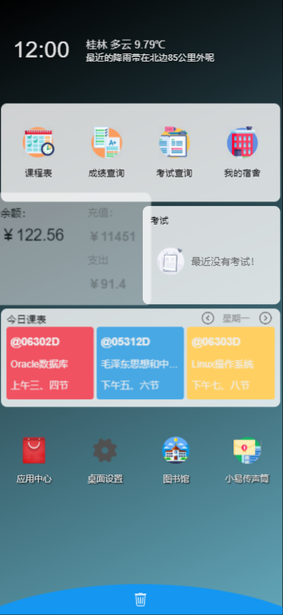

# WebAppOS
使用JavaScript编写的可以在网页上（浏览器）运行小程序的框架（非微信小程序、QQ小程序等）

# 框架
本框架可以在现代流行浏览器（IE10+、Chrome、FireFox、Safari等）上运行基于HTML，JS开发的应用。  
其中桌面等应用均可以自行开发修改。  

# 演示
演示地址：https://yiban.glut.edu.cn/static/in/  
以上项目以移动端使用为主。  
源码已开源  
开源版本使用JAVA制作，JDK1.8。  
可使用JAVA、PHP等作为后端。  

# 定制版本
适用校园应用开发、应用统一管理，支持多人同时上传源码，共同开发，远程编译等。
定制欢迎私聊 QQ：877562884 备注 WebAppOS  
定制内容包含：框架核心及源码、Windows版WebAppOS小程序开发工具、Android版WebAppOS应用安装包APK、免费技术支持、功能定制等  

# 特点
小程序互相独立，可调用框架提供的api接口。  
可以实现安装应用，更新应用，卸载应用，框架已经自动实现。  
框架可以进行二次开发，实现自己的逻辑。  
启动速度极快！使用了JS、CSS压缩，本地缓存等方式节省数据流量传输，增快启动速度  

# 其它信息

## 应用生命周期
应用拥有onLoad onBack onUnload onHide onShow onUpdate onMessage 等事件  
启动应用时会触发onLoad  
用户点击返回键时会触发onBack  
应用销毁时会触发onUnload  
应用隐藏时会触发onHide  
应用显示时会触发onShow  
应用更新时会触发onUpdate  
应用在接收到来自其他应用的消息时会触发onMessage  

## 应用间可以建立有限的通信
两个应用之间可以使用sendMessage接口来互相传递数据。  
应用不能相互调用、读取或修改其他应用未公开的数据。  

## 框架支持打包成Android App（APK）
打包后可以实现二维码扫一扫 客户端进行get、post请求等网页实现不了的功能  
App可以进行二次开发  

## 关于后端
框架非静态，需要后端支持。  
后端使用前后端分离技术，理论上任何编程语言都可以。  
本项目不限语言作为后端，可以使用各种语言可以自行制作。  

## 数据绑定
### 只需要修改变量即可修改视图。

## 应用间相互独立
使用跨域让应用无法修改其他应用，获取信息，等不安全操作  
同时提供api接口实现应用间的有限通信  

## 运行应用
可以用这个框架快速开发自己的应用。  

## 配备开发工具
使用VB编写的开发工具，不用安装任何像jre，.net等框架，可以实现windows平台通用，点开即用。  
使用开发工具上架应用简单方便，提高工作效率。  

## 应用编译
编译代码，ES6转ES5，压缩代码等可选项，项目可以自由配置这些设置。  

## 支持第三方开发
应用框架支持第三方开发者进行开发应用和上传应用  
第三方应用需要经过管理员审核才可上架，可设置自动审核  

## 性能卓越
启动速度快。  
运行效率高，性能卓越，无卡顿。  

## 应用代码缓存
使用LiteStorage进行本地存储。  
实现应用第二次打开无需重新下载源码。  
极大的增加了应用的启动速度和用户体验。  

## 使用localforage库实现通用本地存储能力
支持主流的所有浏览器  
不支持的浏览器做降级处理，达到兼容的效果  
使用缓存顺序：indexedDB、webSQL、localStorage  

## 封装供应用调用的API库
api对象可以实现各种常用操作  

## 提供HTML基本组件
自带UI组件，能够使用组件快速创建好看的页面  

# 演示图片
## Windows版开发工具，适用于多人协同开发小程序：

登录界面  
  
小程序列表显示  
  
小程序编辑界面  

## Web版开发工具，随时随地不限系统开发：
  
小程序列表显示  
  
小程序HTML源码编辑界面  
  
小程序JS源码编辑界面  
## Chrome作为小程序调试运行工具：
  
## 小程序运行效果：
  
桌面壁纸小程序界面  
  
小组件管理小程序界面  
  
桌面界面，可长按小组件或图标拖动或删除  

# 关于小程序自带应用
注：所有小程序应用均可以自行更改，桌面壁纸、小组件管理均为框架下开发的小程序，并不是框架自带的，仅作为框架运行演示。  
