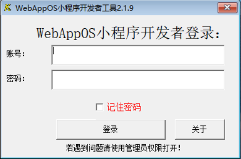

# WebAppOS
使用JavaScript编写的可以在浏览器中运行的小程序框架（非微信小程序、QQ小程序等）  
官方Q群：826920854  

# 框架
本框架可以在现代流行浏览器（IE10、Chrome、FireFox、Safari等）上运行基于HTML，JS开发的应用。  
主流设备兼容率达99.9%，小程序个数和使用无限制。  
所有应用均可以自行开发和修改。  
本框架已开源，适合长期使用，可永久免费使用！  
有任何问题请提Issue，点star不迷路  

# 演示
真实演示地址：https://yiban.glut.edu.cn/static/in/  
以上项目是正在使用、以移动端使用为主的校园应用聚合平台。  
源码已开源，可使用JAVA或PHP等作为后端。  

# 使用场景
校园应用聚合平台  
基于区块链的分布式应用平台  

# 如何部署？
## Java版
将目录下所有文件部署到tomcat后  
将数据库.sql导入MySQL数据库  
/java/src/WebAppOSConfig.properties 数据库配置文件  
运行tomcat即可  
MySQL版本必须为8.0及以上版本，否则会出现部分字段无法导入  

## PHP版
将php目录下所有文件上传到服务器，将数据库.sql导入MySQL数据库即可  
可使用nginx配置静态文件分离，static目录下设置静态访问以加快速度（可省略此步骤）  
MySQL版本必须为8.0及以上版本，否则会出现部分字段无法导入  
\php版\api\compile\为编译静态资源  
\php版\api\os\config.class.php 数据库配置文件  

## 访问地址
框架访问地址：/webappos/static/os/  
框架后台访问地址：/webappos/static/manage/  
后台管理账号默认密码均为admin  
第一次登录建议修改密码  

# 产品建议或问题
可以提issue或私聊 QQ：877562884 备注 WebAppOS  
免费提供：框架核心及源码、Windows版WebAppOS小程序开发工具、Android版WebAppOS应用安装包APK、技术支持、功能定制等  

# 使用系统黑科技
使用iframe下domain的跨域特性让每一个同时运行的小程序互不干扰  
使用https://github.com/chrrg/LiteStorage 缓存技术大大加快了二次访问的速度，设备兼容达99%  
使用https://github.com/chrrg/js-setTimeout-Fix 封装技术解决Chrome内核下的bug  
完全原生JS写法，每一行代码都是精华，拒绝冗余，只为更高的性能、更流畅的体验。  

# 特点
支持第三方开发者开发小程序。  
小程序互相独立，可调用框架提供的api接口。  
可以实现安装应用，更新应用，卸载应用，框架已经自动实现。  
框架可以进行二次开发，实现自己的逻辑。  
启动速度极快！使用了JS、CSS压缩，本地缓存等方式节省数据流量传输，增快启动速度  

# 其它信息

## 应用生命周期
应用拥有onLoad onBack onUnload onHide onShow onUpdate onMessage 等事件  
启动应用时会触发onLoad  
用户点击返回键时会触发onBack(返回false可取消返回)  
应用销毁时会触发onUnload  
应用隐藏时会触发onHide  
应用显示时会触发onShow  
应用更新时会触发onUpdate  
当应用接收到来自其他应用的消息时会触发onMessage  

## 应用间可以建立有限的通信
两个应用之间可以使用sendMessage接口来互相传递数据。  
应用不能相互调用、读取或修改其他应用未公开的数据。  

## 框架支持打包成Android App（APK）
打包后可以实现二维码扫一扫、定位、客户端进行get、post请求等网页实现不了的功能  
一端开发、多端使用
App可以进行二次开发  

## API
每个应用能获得拷贝的api句柄  
应用能通过调用api下的方法进行各种操作  
如：  
api.title("标题test")//修改标题  
api.color("#1234FF")//修改颜色  
api太多，详见系统应用源码（部署后后台可见）

## 关于后端
整体项目分为前端和后端。  
前端需要后端支持。  
已开源Java和PHP后端、任选其一即可。
整体项目使用前后端分离技术，理论上任何编程语言都可以。  
本项目不限语言作为后端，理论可以使用任何编程语言制作。  

## 数据绑定
自带简单数据绑定逻辑、可轻松使用数据绑定进行页面的渲染

## 应用间相互独立
使用跨域让应用无法修改其他应用，获取信息，等不安全操作  
同时提供api接口实现应用间的有限通信  

## 配备开发工具
使用VB编写的开发工具，不用安装任何像jre，.net等框架，可以实现windows平台通用，点开即用。  
使用开发工具上架应用简单方便，提高工作效率。  

## 应用编译
编译代码，ES6转ES5，压缩代码等可选项，项目可以自由配置这些设置。  

## 支持第三方开发
应用框架支持第三方开发者进行开发应用和上传应用  
第三方应用需要经过管理员审核才可上架，可设置自动审核  

## 性能卓越
使用异步JS、底层使用ES5写法、兼容旧设备且启动速度快。  
运行效率高，性能卓越，无卡顿。  
系统第二次启动速度平均在100ms内。（取决于设备性能）  

## 应用代码缓存
使用LiteStorage进行本地存储。  
实现应用第二次打开无需重新下载源码。  
极大的增加了应用的启动速度和用户体验。  

## 使用localforage库实现通用本地存储能力
支持主流的所有浏览器  
不支持的浏览器做降级处理，达到兼容的效果  
使用缓存顺序：indexedDB、webSQL、localStorage  

## 封装供应用调用的API库
api对象可以实现各种常用操作  

## 提供HTML基本组件
自带UI组件，能够使用组件快速创建好看的页面  

# 演示图片
## Windows版开发工具，适用于多人协同开发小程序：
  
登录界面  
  
小程序列表显示  
  
小程序编辑界面  
## Web版开发工具，随时随地不限系统开发：
  
小程序列表显示  
  
小程序HTML源码编辑界面  
  
小程序JS源码编辑界面  

## Chrome作为小程序调试运行工具：
  

## 小程序运行效果：
  
桌面壁纸小程序界面  
  
小组件管理
